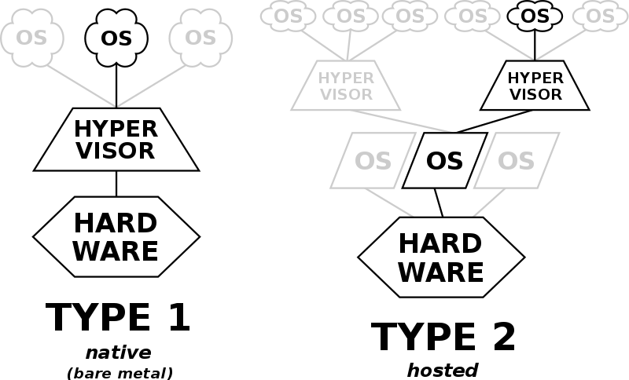

Title: 102.6 لینوکس به عنوان مهمان مجازی سازی
Date: 2010-12-03 10:20
Category: LPIC1
Tags: LPIC1, 101, LPIC1-101-500
Authors: Jadi
Summary: داوطلبان باید مفاهیم مجازی سازی و رایانش ابری را در سیستم مهمان لینوکس درک کنند.
sortorder: 110

*وزن: 1*

داوطلبان باید مفاهیم مجازی سازی و رایانش ابری را در سیستم مهمان لینوکس درک کنند.

## حوزه های دانش کلیدی

- درک مفهوم کلی ماشین های مجازی و کانتینرها
- درک عناصر رایج ماشین های مجازی در یک ابر IaaS، مانند نمونه های محاسباتی، ذخیره سازی بلوک، و شبکه
- ویژگی های منحصر به فرد یک سیستم لینوکس را که باید هنگام شبیه سازی یا استفاده از یک سیستم به عنوان یک الگو تغییر کند، درک کنید.
- درک نحوه استفاده از تصاویر سیستم برای استقرار ماشین های مجازی، نمونه های ابری و کانتینرها
- برنامه های افزودنی لینوکس را که لینوکس را با محصول مجازی سازی ادغام می کنند، درک کنید.
آگاهی از cloud-init

### شرایط
- ماشین مجازی
- ظرف لینوکس
- ظرف برنامه
- رانندگان مهمان
- کلیدهای میزبان SSH
- شناسه دستگاه D-Bus

<iframe width="560" height="315" src="https://www.youtube.com/embed/F3yl5Lx1htc" title="YouTube video player" frameborder="0" allow="accelerometer; autoplay; clipboard-write; encrypted-media; gyroscope; picture-in-picture" allowfullscreen></iframe>

## مقدمه
ماشین‌های مجازی (VM) کامپیوترهای *شبیه‌سازی شده* هستند. می‌توانید از ماشین‌های مجازی برای ایجاد رایانه‌های جدید در بالای دستگاه در حال اجرا و نصب سیستم‌عامل جدید در آنجا استفاده کنید. در برخی موارد، این امکان نیز وجود دارد که فقط بخش‌هایی از یک سیستم‌عامل را در بالای سیستم‌عامل فعلی اجرا کنید. به این میگن ظروف داشتن. 

برای اجرای ماشین‌های مجازی، به نرم‌افزار **Hypervisor** (که به آن Virtual Machine Manager (VMM نیز می‌گویند) نیاز داریم. ما دو نوع هایپروایزر داریم.

برای بررسی و بررسی اینکه آیا سیستم عامل/CPU میزبان شما از استفاده از هایپروایزر پشتیبانی می‌کند، `vmx` (برای پردازنده‌های اینتل) یا `svm` (برای CPU‌های AMD) را در پرچم‌های `/proc/cpuinfo` خود بررسی کنید. 

> ممکن است لازم باشد گزینه Hypervisor را با استفاده از BIOS یا UEFI روشن کنید.

بر اساس CPU خود باید ماژول های هسته `kvm` یا `kvm-amd` را بارگذاری کنید. 

```
lsmod | grep -i kvm
sudo modprobe kvm
```

> اگر در `/proc/cpuinfo` خود `hypervisor` را مشاهده کردید، به این معنی است که شما در داخل یک ماشین لینوکس مجازی هستید :)

حالا بیایید 2 نوع هایپروایزر را ببینیم. اول نوع 2، زیرا درک آن آسان تر است. 


### هایپروایزر نوع 2
این هایپروایزرها بر روی یک سیستم عامل معمولی (OS) درست مانند سایر برنامه های کامپیوتری اجرا می شوند. یک سیستم عامل مهمان به عنوان یک فرآیند روی هاست اجرا می شود. هایپروایزرهای نوع 2 سیستم عامل مهمان را از سیستم عامل میزبان انتزاعی می کنند.

به عبارت دیگر، هایپروایزر نوع 2 نرم افزار بین مهمان و میزبان است. به طور کامل بر روی سیستم عامل میزبان اجرا می شود و مجازی سازی را در اختیار مهمان قرار می دهد. 

دو تا از معروف ترین هایپروایزرهای نوع 2 VirtualBox (از Oracle) و VMware هستند.

### هایپروایزر نوع 1
این هایپروایزرها برای کنترل سخت افزار و مدیریت سیستم عامل مهمان مستقیماً روی سخت افزار میزبان اجرا می شوند. به همین دلیل، گاهی اوقات آنها را هایپروایزرهای فلزی برهنه می نامند. اولین هایپروایزر که IBM در دهه 1960 توسعه داد، هایپروایزرهای بومی بودند. اینها شامل نرم افزار آزمایشی SIMMON و سیستم عامل CP/CMS، سلف IBM z/VM بود.


برخی از معروف ترین هایپروایزرهای نوع 1 KVM، Xen و Hyper-V هستند. **KVM** از نسخه 2.6.20 کرنل لینوکس داخلی است. 
## ایجاد یک ماشین مجازی
ابتدا خود دستگاه را ایجاد کنید. ما به هایپروایزر این دستگاه می گوییم که چه مقدار RAM/disk/CPU/... نیاز دارد و یک نام برای دستگاه خود تعیین می کنیم. سپس باید سیستم عامل مهمان را *نصب* کنیم. این را می توان با استفاده از:

- نصب از روی CD / DVD / ... 
- ** شبیه سازی ** یک ماشین موجود
- استفاده از **فرمت مجازی سازی باز (OVF)** برای جابجایی ماشین ها بین هایپروایزرها. این یک فرمت استاندارد برای تعریف ماشین مجازی است و ممکن است شامل چندین فایل باشد، در این مورد، می توانید همه آنها را در یک فایل **باز کردن بایگانی مجازی سازی (OVA)** بایگانی کنید.
- همچنین امکان ایجاد **قالب**هایی که _نسخه اصلی_* هستند برای راه اندازی ماشین های جدید وجود دارد.

> ممکن است لازم باشد برخی *درایورهای مهمان* یا *افزونه*ها را نصب کنید تا به هایپروایزر کمک کنید تا کنترل بهتری بر دستگاه مهمان شما داشته باشد. اینها ممکن است شامل درایورهای گرافیکی برای VirtualBox یا اسکریپت هایی باشد که به VMWare کمک می کند تا یک ماشین مهمان را کنترل کند یا وضعیت آن را بررسی کند. 

## تنظیمات ویژه مهمان
برخی از تنظیمات مربوط به ماشین هستند. به عنوان مثال، آدرس MAC کارت شبکه باید برای کل شبکه منحصر به فرد باشد. اگر ما در حال شبیه‌سازی یک ماشین هستیم یا گاهی اوقات آنها را از قالب‌ها ایجاد می‌کنیم، حداقل باید قبل از راه‌اندازی آن‌ها را در هر دستگاه تغییر دهیم:

- `uname` میزبان
- آدرس MAC NIC
- IP NIC (در صورت عدم استفاده از DHCP)
- شناسه ماشین (`/etc/machine-id` و `/var/lib/dbus/machine-id` را حذف کنید و `dbus-uuidgen --ensure` را اجرا کنید. این دو فایل ممکن است پیوندهای نرمی به یکدیگر باشند)
- کلیدهای رمزگذاری مانند اثر انگشت SSH و کلیدهای PGP
- UUID های HDD
- هر UUID دیگر روی سیستم

> برخی از تنظیمات ممکن است در قالب ها خالی باشند، فراموش نکنید که آنها را نیز پر کنید.


## ظروف


در قسمت های قبلی با سیستم عامل های مهمان کامل سروکار داشتیم. اما امکان مجازی سازی تنها بخش هایی از سیستم عامل نیز وجود دارد. این مجازی سازی در سطح سیستم عامل نامیده می شود. 

مجازی سازی در سطح سیستم عامل یک الگوی سیستم عامل (OS) است که در آن هسته امکان وجود چندین نمونه فضای کاربری (User Space) مجزا به نام کانتینر را می دهد.

این را می توان برای اجرای یک برنامه یا یک سرویس یا حتی اجرای بیشتر بخش های یک سیستم عامل جدید برای اهداف آزمایشی انجام داد. 

## IaaS
همانطور که از نام آن پیداست، **زیرساخت به عنوان سرویس** یا IaaS به معنی بارگیری بخش هایی از زیرساخت شما به شرکت های دیگر است. این به معنای خرید *سرویس*هایی مانند برق، سرمایش و حتی اجرای هایپروایزرها برای شرکتی دیگر و اجاره ماشین مجازی خود از آنهاست. این کار زندگی شما را آسان‌تر می‌کند، زیرا چیزهایی مانند "افزودن هارد جدید" اکنون فقط به معنای پرداخت مقداری بیشتر برای هارد دیسک بیشتر در دستگاه شماست. به جای خرید HDD و نصب آنها، ... به این می گویند ابر! حتی ممکن است بتوانید دستگاه خود را تنها با یک کلیک از یک قاره به قاره دیگر منتقل کنید. 

نمونه‌هایی از این ارائه‌دهندگان ابری عبارتند از [Amazon Web Services][1]، [Google Cloud Platform][2] و [Microsoft Azure][3].

ارائه دهندگان ابری مختلف ممکن است سطوح مختلفی از زیرساخت یا خدمات را ارائه دهند. این چند نمونه است:

- تعادل بار: درخواست های دریافتی را بین سرورهای خود توزیع کنید
- Block Storage: ارائه دیسک هایی که توسط شما پیکربندی شده و به ماشین های شما اضافه می شوند
- Object Storage: به شما امکان می دهد داده های خود را مستقیماً ذخیره کنید. برای عکس بگو
- الاستیسیته: به شما امکان می دهد افزایش/کاهش خودکار ظرفیت سرویس خود را بر اساس حجم درخواست پیکربندی کنید.
- SaaS: Software as a Service به شما امکان می دهد از نرم افزار مورد نیاز خود در Cloud as a Service استفاده کنید. به داشتن یک مجموعه اداری آنلاین برای شرکت خود بدون نصب چیزی روی ایستگاه های کاری خود فکر کنید.

برنامه هایی مانند `cloud-init` وجود دارد که به شما کمک می کند تا ماشین ابری خود را به راحتی مقداردهی اولیه کنید. این سرویس می‌تواند به شما کمک کند ماشین‌های مبتنی بر الگوهای AWS، Azure، Digital Ocean و سایر موارد را به راحتی راه‌اندازی کنید.

[1]: (https://aws.amazon.com/)
[2]:(https://cloud.google.com/)
[3]: (https://azure.microsoft.com/en-us/)